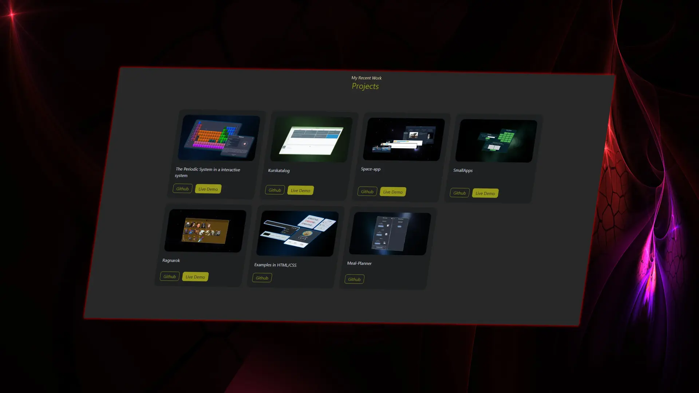

## :microscope: Portfolio



This is a website with I show my projects, complete and incomplete.

[](https://reactjs.org)
[](https://www.typescriptlang.org/)
[](https://tailwindcss.com/)

## :seedling: Getting started

This is an instruction to setting up the project locally.

### Prerequisities

Node and npm is needed to run react

### How to install and run the project
The first thing you need to do is to clone the project to you own computer.

```
git clone git@github.com:luigi989/projects-showcase.git
```

1. After that go to the folder newly created folder /projects--shocase
2. Open a terminal in this location and run

```
npm i
```

3. Start the project

```
npm start
```

## :triangular_flag_on_post: Future development

* Will be updated and improved on
